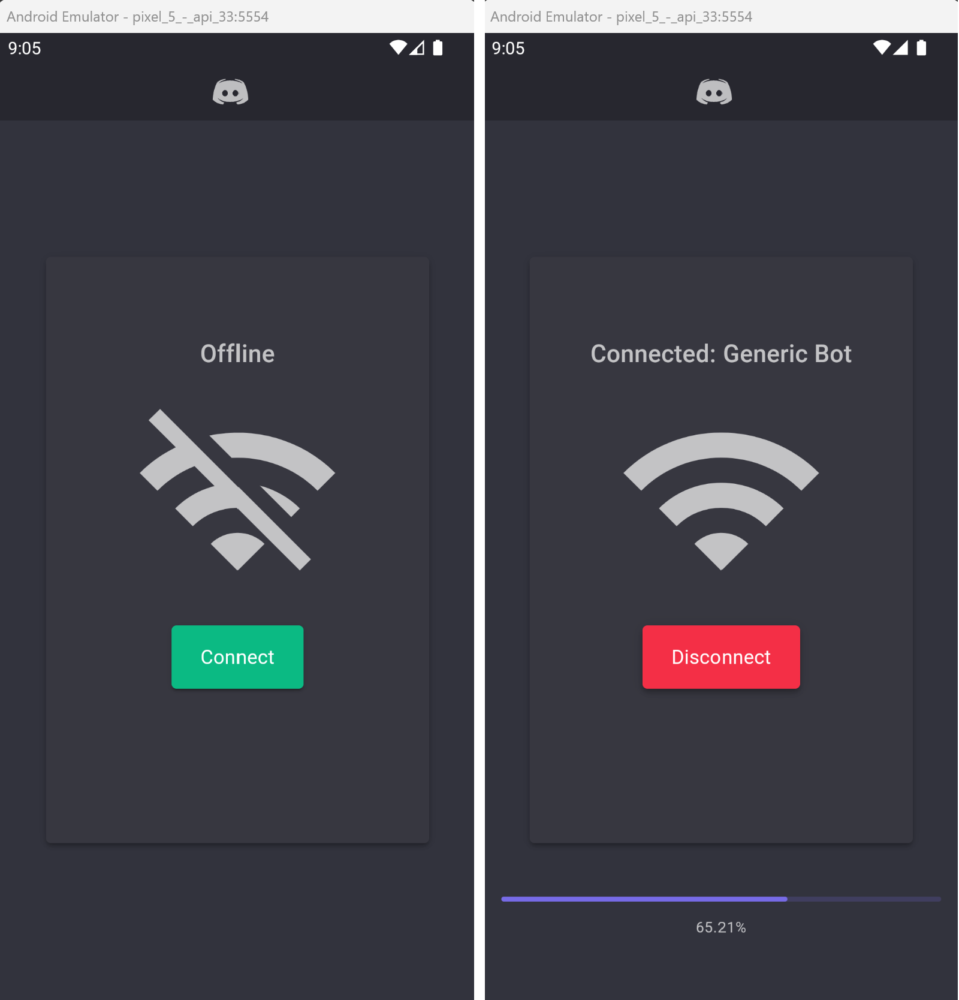

# Discord Bot Host

This is a basic example of using an Android application to host a Discord Bot. 

Basic Features
- Connect/Disconnect a Bot Application to the Discord Gateway
- Example slash command: Ping
- Example user command: Show Color
- System logs visible on error


